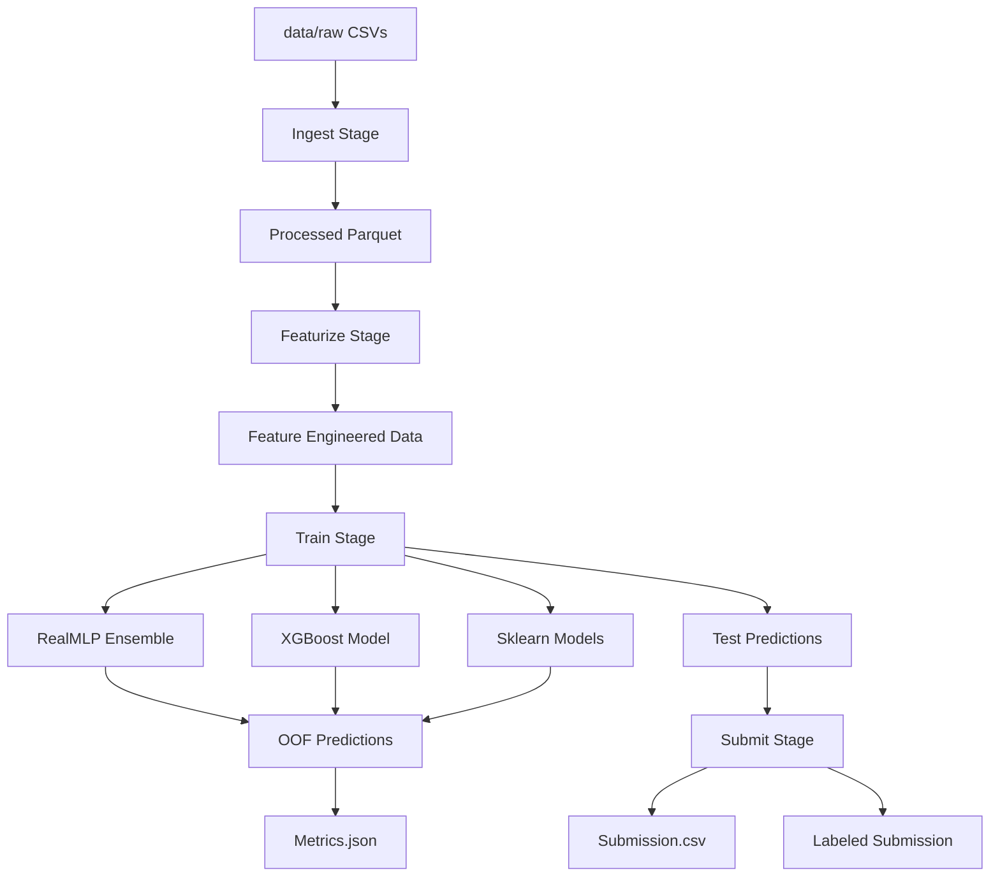
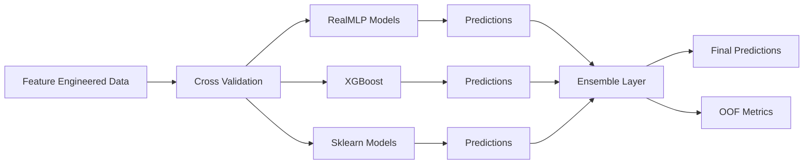
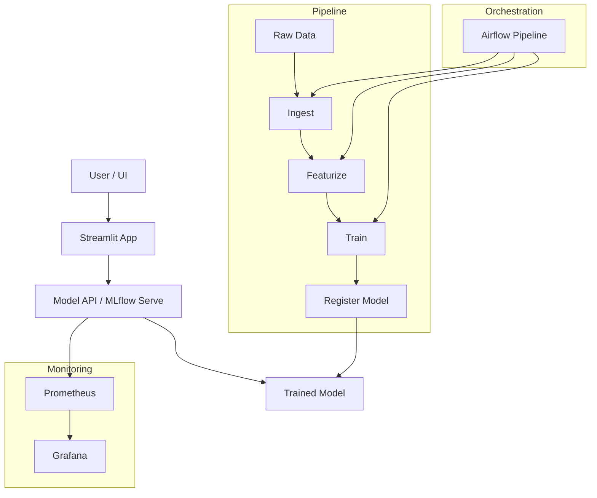
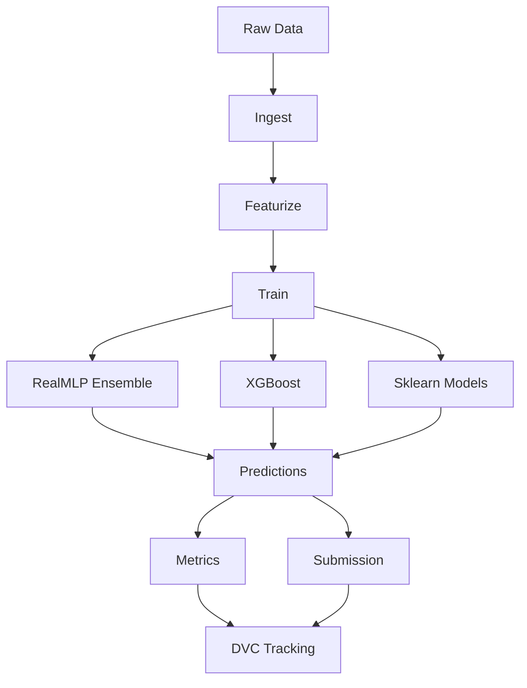

# 🫀 Heart Disease Prediction 

A fully reproducible **end-to-end MLOps pipeline** for heart disease prediction using **RealMLP, XGBoost, and Scikit-learn models**, orchestrated with **DVC**.

---

## 🚀 Project Overview

This project implements a modular ML pipeline with:

* Data ingestion & validation
* Feature engineering
* Multi-model training (RealMLP + XGBoost + sklearn)
* Ensemble predictions
* Submission generation

Built with:

✔ Reproducibility (DVC)\
✔ Config-driven experimentation (`params.yaml`)\
✔ Modular pipeline design\
✔ Scalable MLOps architecture

---

## 🔄 DVC Pipeline



---

## 🧠 Model Training Architecture



---

## 🖥️ MLOps System Architecture



---

## 🔗 Unified Pipeline + Models



---

## ⚙️ Tech Stack

* **Modeling**

  * RealMLP (deep tabular model)
  * XGBoost
  * Scikit-learn ensemble (RF + Logistic Regression)

* **Pipeline**

  * DVC (Data Version Control)

* **Data Processing**

  * Pandas, NumPy

* **Orchestration**

  * Airflow

* **Tracking **

  * MLflow

* **Monitoring**

  * Grafana + Prometheus

---

## 📂 Project Structure

```bash
.
├── pipeline/                         # Core DVC ML pipeline
│   ├── dvc.yaml
│   ├── dvc.lock
│   ├── params.yaml
│   │
│   ├── src/                         # Pipeline stages
│   │   ├── ingest.py
│   │   ├── preprocess.py
│   │   ├── featurize.py
│   │   ├── train_realmlp.py
│   │   ├── train_xgboost.py
│   │   ├── train_sklearn.py
│   │   ├── serve_best.py
│   │   └── streamlit_app.py
│   │
│   ├── data/
│   │   ├── raw/                     # Input CSVs
│   │   └── processed/               # Feature datasets (DVC tracked)
│   │
│   └── outputs/                     # Model outputs per framework
│       ├── realmlp/
│       ├── xgboost/
│       └── sklearn/
│
├── mlops_console/                   # Unified Streamlit UI
│   ├── mlops_console.py
│   ├── Dockerfile
│   └── requirements.txt
│
├── airflow/                         # Airflow logs + pipeline runs
│   └── logs/
│
├── config/
│   └── airflow.cfg
│
├── plugins/                         # Airflow plugins (if any)
│
├── docker/ (implicit via root files)
│   ├── Dockerfile.airflow
│   ├── Dockerfile.mlflow
│   ├── Dockerfile.streamlit
│
├── monitoring/                      # Prometheus config
│   └── prometheus.yml
│
├── prometheus/                      # Prometheus rules
│   ├── rules/
│   │   ├── alerting_rules.yml
│   │   └── recording_rules.yml
│   └── prometheus.yml
│
├── grafana/                         # Grafana dashboards
│   ├── dashboards/
│   │   └── heart_disease.json
│   └── provisioning/
│
├── alertmanager/                    # Alerting system
│   ├── alertmanager.yml
│   └── templates/
│
├── mlflow_data/                     # MLflow tracking artifacts
│
├── docs/                            # Sphinx documentation
│   ├── source/
│   └── build/
│
├── tests/                           # Test suite
│   ├── test_smoke.py
│   ├── test_streamlit_app.py
│   └── TEST_PLAN.md
│
├── openapi.yaml                     # API specification
├── README.md
├── pytest.ini
├── .env
└── .gitignore
```

---

## 🧩 Pipeline Stages

### 1️⃣ Ingest

* Loads raw CSVs
* Encodes target labels
* Optional dataset merging
* Outputs clean parquet files

---

### 2️⃣ Featurize

* Missing value imputation
* Categorical encoding
* Feature engineering:

  * Ratios
  * Interaction features
  * Derived features
* Saves feature metadata

---

### 3️⃣ Train

* 5-fold cross-validation
* Trains:

  * RealMLP ensemble
  * XGBoost
  * sklearn models
* Outputs:

  * OOF predictions
  * Test predictions
  * Metrics

---

### 4️⃣ Submit

* Generates submission file
* Adds labeled predictions

---


## 🚀 Quick Start

```bash
docker compose up
```

---

## 🔁 Experimentation & Tuning

All parameters are controlled via:

```bash
params.yaml
```

DVC automatically reruns only affected stages.

---

### 🔧 Example

```yaml
features:
  digit_enabled: false
```

```bash
dvc repro
```

---

### 🔍 Compare Experiments

```bash
dvc metrics diff
```

---

## 🧠 Design Principles

* **Modular** — independent pipeline stages
* **Reproducible** — full DVC tracking
* **Config-driven** — no hardcoding
* **Scalable** — easy to extend models/pipeline

---

## 📌 Future Improvements

* MLflow experiment tracking
* Airflow orchestration UI
* Model deployment API
* Real-time monitoring dashboard
* Feature store integration

---

## 🧑‍💻 Author

Alan \
BS22B001

---
